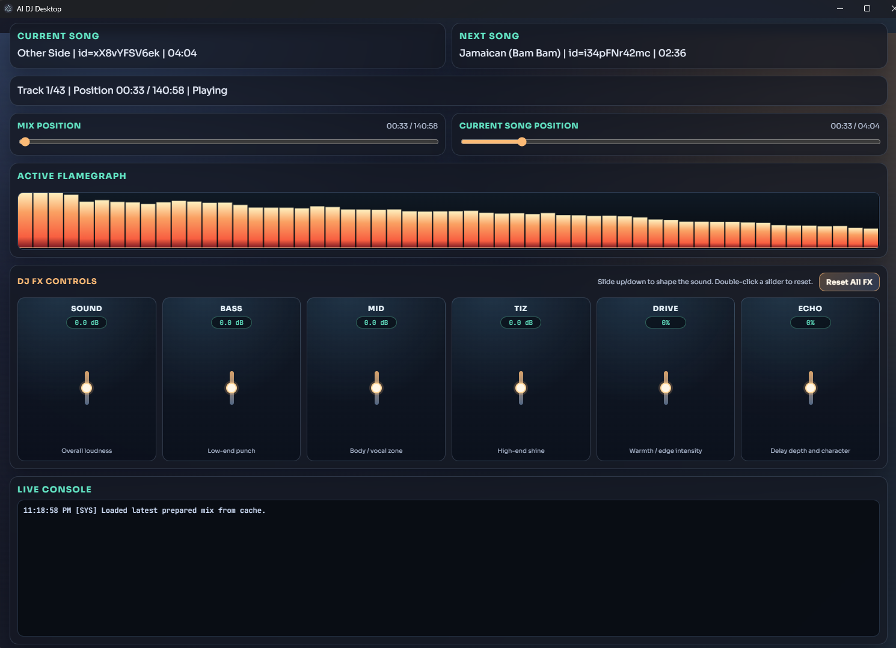

```text
               ___       _ ___ _   _  ____
              / _ \     | |_ _| \ | |/ ___|
             / /_\ \  _ | || ||  \| | |  _
            / /___\ \| || || || |\  | |_| |
           /_/     \_\\__/|___|_| \_|\____|

	 /__________________________________________/|
	|                                          | |
	|   .-------------------------------.      | |
	|   |   .----.           .----.     |      | |
	|   |  /      \         /      \    |      | |
	|   | |  DJ    |  + +  |  MIX   |   |      | |
	|   |  \______/         \______/    |      | |
	|   |      ________________         |      | |
	|   |_____/________________\________|      | |
	|      \________________________/          | |
	|__________________________________________|/
				||                      ||
			 _||_                    _||_
			/____\                  /____\
```

# AI DJ for YouTube Music PlayAJING - list

Node.js AI DJ engine for YouTube/YouTube Music playlists with:

- Private playlist support (OAuth refresh token or yt-dlp cookies)
- Random unplayed selection with BPM-aware ordering
- Strict beatmatch mode (default): next track BPM is matched to previous track BPM
- Random transition presets
- Detailed progress output with spinner-friendly logs
- Persistent played/unplayed/unavailable state
- Automatic skip of unavailable videos
- Cache reuse by track ID (no duplicate downloads)
- Optional Windows desktop app UI with playback controls

## Requirements

- Node.js 18+
- yt-dlp
- ffmpeg
- ffprobe
- ffplay

On Windows, ensure those binaries are available in PATH or set absolute paths in `.env`.

## Setup

1. Install dependencies:

```bash
npm install
```

2. Create your env file:

```bash
copy .env.example .env
```

3. Fill required values in `.env`.

## Private Playlist Auth Options

### Option A: OAuth refresh token (recommended)

Use these env keys:

- `PLAYLIST_FETCH_MODE=youtube-api`
- `GOOGLE_CLIENT_ID`
- `GOOGLE_CLIENT_SECRET`
- `GOOGLE_REFRESH_TOKEN`

Required scope:

```text
https://www.googleapis.com/auth/youtube.readonly
```

### Manual refresh token flow (OAuth Playground)

1. Create a Web OAuth client in Google Cloud.
2. Add redirect URI:

```text
https://developers.google.com/oauthplayground
```

3. Open OAuth Playground.
4. Enable "Use your own OAuth credentials".
5. Paste your client ID/secret.
6. Authorize scope `https://www.googleapis.com/auth/youtube.readonly`.
7. Exchange code for tokens.
8. Copy `refresh_token` to `GOOGLE_REFRESH_TOKEN`.

### Option B: yt-dlp cookies

Use:

- `PLAYLIST_FETCH_MODE=yt-dlp` (or `auto`)
- `YTDLP_COOKIES_FROM_BROWSER` and/or `YTDLP_COOKIES_FILE`

## CLI Usage

Run DJ:

```bash
npm run dj
```

Show state only:

```bash
npm run status
```

Reset all tracks to unplayed and run again:

```bash
npm run reset
```

Run OAuth helper:

```bash
npm run oauth:youtube
```

## Desktop App (Windows)

The desktop app provides:

- Embedded console output
- Current song and next song details (name, id, duration)
- Playback controls: Pause/Play, Prev Song, Next Song, Reset

Run desktop app in development:

```bash
npm run desktop:dev
```

Build Windows desktop app into `.build`:

```bash
npm run desktop:build
```

Desktop behavior:

- Mix is prepared by running the DJ engine in render mode (`PLAY_AUDIO=false`)
- Timeline metadata is exported to `DJ_SESSION_FILE`
- Desktop player uses that timeline for Prev/Next controls
- Prepared mix is reused from cache on next launches
- A new mix with fresh random order/transitions is generated only when `Reset` is clicked
- Playback position/state is persisted and resumed after reopening the app
- Packaged app looks for `.env` in multiple locations: exe folder, parent folders, and current working directory

If desktop build shows missing `PLAYLIST_URL`/`GOOGLE_PLAYLIST_ID`, place `.env` next to the generated `.exe` or in its parent project folder.

## Environment Variables

| Key | Default | Description |
|---|---|---|
| `PLAYLIST_URL` | _(none)_ | Playlist URL. |
| `PLAYLIST_FETCH_MODE` | `auto` | `auto`, `yt-dlp`, `youtube-api`. |
| `YTDLP_COOKIES_FROM_BROWSER` | _(empty)_ | Browser cookie source for yt-dlp. |
| `YTDLP_COOKIES_FILE` | _(empty)_ | Netscape cookies file path for yt-dlp. |
| `YTDLP_USE_COOKIES_FOR_DOWNLOAD` | `false` | Use cookies during track audio download. |
| `GOOGLE_OAUTH_CLIENT_TYPE` | `desktop` | OAuth helper mode: `auto`, `desktop`, `web`. |
| `GOOGLE_CLIENT_ID` | _(empty)_ | Google OAuth client ID. |
| `GOOGLE_CLIENT_SECRET` | _(empty)_ | Google OAuth client secret. |
| `GOOGLE_REFRESH_TOKEN` | _(empty)_ | Refresh token for YouTube API mode. |
| `GOOGLE_REDIRECT_URI` | `http://localhost:53682` | OAuth helper redirect URI for web mode. |
| `GOOGLE_PLAYLIST_ID` | _(empty)_ | Optional playlist ID override. |
| `YTDLP_BIN` | `yt-dlp` | yt-dlp executable path/command. |
| `FFMPEG_BIN` | `ffmpeg` | ffmpeg executable path/command. |
| `FFPROBE_BIN` | `ffprobe` | ffprobe executable path/command. |
| `FFPLAY_BIN` | `ffplay` | ffplay executable path/command. |
| `CACHE_DIR` | `.cache` | Cache root directory. |
| `STATE_FILE` | `.cache/dj-state.json` | Persistent played/unplayed/unavailable state. |
| `OUTPUT_FILE` | `.cache/output/ai-dj-mix.wav` | Rendered mix output audio file. |
| `DJ_SESSION_FILE` | `.cache/output/ai-dj-session.json` | Session timeline metadata for desktop controls. |
| `BPM_SAMPLE_SECONDS` | `35` | Seconds sampled for BPM estimation. |
| `TEMPO_MATCH_POOL_SIZE` | `5` | Candidate pool for random next-track selection by BPM closeness. |
| `STRICT_BPM_MATCH` | `true` | If true, next track BPM is matched exactly to current track BPM. |
| `MAX_TEMPO_SHIFT_PERCENT` | `8` | Used only when strict beatmatch is false. |
| `MIN_TRANSITION_SECONDS` | `5` | Minimum transition duration. |
| `MAX_TRANSITION_SECONDS` | `10` | Maximum transition duration. |
| `PLAY_AUDIO` | `true` | If false, render only (no immediate ffplay playback). |
| `MARK_PLAYED_WHEN_NOT_PLAYING` | `true` | If `PLAY_AUDIO=false`, mark planned tracks as played after render. |
| `CLEAN_TEMP_AFTER_RUN` | `false` | Cleanup intermediate render files after run. |
| `DISABLE_SPINNERS` | `false` | Disable animated spinner output. |
| `AUTO_RESET_ON_START` | `false` | Reset played flags at startup. |

## Troubleshooting

### Access blocked / authorization error (Google OAuth)

- Ensure YouTube Data API v3 is enabled
- OAuth consent screen is in Testing
- Your account is listed as Test user
- Use OAuth Client ID (not service account)

### Could not copy Chrome cookie database

Close Chrome completely and retry. If needed, use exported cookies file:

```env
YTDLP_COOKIES_FROM_BROWSER=
YTDLP_COOKIES_FILE=C:/path/to/cookies.txt
```

### Video unavailable

Unavailable tracks are skipped and marked unavailable in state.

### Error parsing Opus packet header

Usually non-fatal source stream corruption. This project tolerates and suppresses noisy decode warnings where possible.
